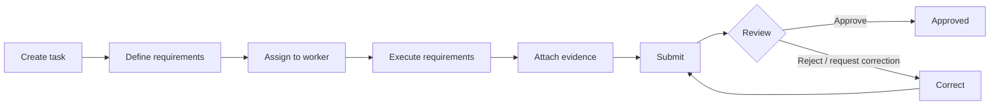

# TaskInspect

**Offline-first task and inspection management platform.**

TaskInspect lets a manager create a task, define the requirements that must be
completed, and assign it to a worker. The worker completes each requirement on
a mobile device — with structured answers, photos and PDF documents — even without a
network connection, then submits it for review. A reviewer approves the task,
rejects it, or requests a correction, and every step is recorded in the task's
history.

> **Status:** in development. The backend and the Android app work end
> to end — task management, offline execution with photos and PDFs,
> background sync, review and correction, teams, open tasks and
> sub-tasks — with 767 backend and 467 Flutter tests and a CI pipeline.
> Next: cloud deployment (AWS, Firebase) and the Google Play release.

## Project Overview

TaskInspect is built as a small but production-oriented product rather than a
CRUD demo. It consists of:

- **Mobile app** — Flutter, where workers execute tasks and managers review them.
  Works offline and synchronizes in the background when connectivity returns.
  Released on Google Play first, then on the Apple App Store.
- **Backend API** — Java / Spring Boot REST API with PostgreSQL, which owns the
  business rules: who can do what, and which task state changes are allowed.
- **Cloud storage** — evidence files (photos, PDFs) are stored in object storage (AWS S3), not in
  the database.

The same workflow fits many industries — kitchen safety checks, facility
inspections, maintenance rounds, audits — because requirements are
configurable per task.

## Core Workflow



1. **Create** — a manager creates a task with a title, description, priority
   and deadline.
2. **Define requirements** — each requirement has a type: checkbox, yes/no,
   text, number, dropdown, multiple selection, photo, PDF document or comment.
3. **Assign** — the task is assigned to a worker.
4. **Execute** — the worker completes each requirement on their phone. This works
   offline: answers are saved locally and synchronized later.
5. **Attach evidence** — photos, PDF documents, values and comments show that the work was
   actually done.
6. **Submit** — the worker submits the task for review.
7. **Review** — the reviewer checks every response and piece of evidence, then
   approves, rejects or requests a correction with a reason.
8. **Correct and resubmit** — a rejected task returns to the worker, who fixes
   it and submits again until it is approved.

The backend enforces every step. For example, a worker cannot approve their own
task, and an approved task cannot be modified — even through a hand-crafted API
request.

### Example: Daily Kitchen Safety Inspection

| Requirement                         | Type    |
|-------------------------------------|---------|
| Is the gas connection safe?         | Yes/No  |
| Record the refrigerator temperature | Number (°C) |
| Is the fire extinguisher available? | Yes/No  |
| Check the electrical equipment      | Checkbox |
| Take a photo of the kitchen         | Photo   |

The worker completes the inspection with no internet connection and submits it.
The app shows *"Submitted locally — waiting for synchronization"* and uploads
everything once the connection returns. The manager reviews the evidence and
asks for the refrigerator photo to be retaken; the worker retakes it and
resubmits, and the manager approves. The task history shows the full lifecycle.

## Features

Built for the first release. Two parts are ready in the code and wait
for the cloud setup: push notifications (the backend sends them; the
app receives them once Firebase is set up) and S3 storage (local file
storage is used until the AWS bucket exists):

### Task management

- Create tasks with a title, description, priority and deadline
- Configurable requirements per task — checkbox, yes/no, text, number (with
  unit), dropdown, multiple selection, photo, PDF document and comment
- Assign tasks to workers and track them by status: pending, in progress,
  submitted, approved, rejected
- A strict task state machine: invalid status changes are rejected by the API

### Task execution (mobile)

- Dashboard with task counts per status, and a filterable task list
- Step-by-step requirement execution with structured answers and comments
- Photo evidence from the camera or gallery, compressed before upload
- PDF documents (certificates, reports) attached from the device's files
- Save progress at any time and continue later

### Offline-first synchronization

- Tasks, answers, photos and PDFs are stored on the device, so work continues
  without a network connection
- Local changes are queued and synchronized in the background when
  connectivity returns, with retries and conflict handling
- File uploads are queued separately, so a slow upload never blocks a
  submission
- The app always shows the sync state: offline, syncing, synced or failed

### Review

- Review every response and piece of evidence of a submitted task
- Approve, reject or request a correction with a reason
- Reject sends the whole task back; a correction request sends back only
  the requirements that need fixing
- Each task has its own reviewer — one manager can assign and another review
- Solo users can review their own tasks, like a personal checklist
- A full history timeline for every task

### Security and platform

- JWT authentication with access and refresh tokens
- Role-based access (administrator, manager, worker) enforced by the backend
- Audit log of important actions (task created, assigned, submitted,
  approved, rejected)
- Push notifications for assignments, submissions and review results
- Evidence files (photos, PDFs) stored in AWS S3; only metadata is kept in the database

## Tech Stack

| Area     | Technologies |
|----------|--------------|
| Mobile   | Flutter, Dart, BLoC, Clean Architecture, Material 3, local database, secure storage, background sync, camera + image compression |
| Backend  | Java, Spring Boot (Web, Security, Data JPA / Hibernate), JWT, OpenAPI / Swagger |
| Database | PostgreSQL (Flyway migrations), Redis where useful |
| Cloud    | AWS S3 (evidence), AWS CloudWatch (logging), Firebase Cloud Messaging (push notifications) |
| DevOps   | Docker, Docker Compose, GitHub Actions (build, test, deploy) |
| Testing  | JUnit, Mockito, Spring Boot Test, Flutter unit / widget / integration tests |
| Tools    | Git, GitHub, Gradle, Android Studio, IntelliJ IDEA, Xcode (iOS, on a cloud Mac) |

## Repository Structure

```text
taskInspect/
├── mobile/            # Flutter app — BLoC, feature-based Clean Architecture, offline-first
├── backend/           # Java / Spring Boot REST API — Security + JWT, JPA, PostgreSQL
├── infrastructure/    # Docker, deployment and AWS configuration
├── docs/              # Architecture, API, database, sync and deployment docs
│   └── decisions/     # Architecture Decision Records
├── .github/           # GitHub Actions workflows (CI)
├── docker-compose.yml # Local PostgreSQL
├── CONTRIBUTING.md    # How changes are made
├── LICENSE            # All rights reserved
└── README.md
```

Each top-level folder has its own `README.md`.

## Roadmap

The project is built in small steps, one phase at a time.

| Phase | Focus | Status |
|-------|-------|--------|
| 1  | Repository and architecture — structure, README, architecture docs, ADRs | Done |
| 2  | Backend foundation — Spring Boot, PostgreSQL, Flyway, JWT authentication, users and roles | Done |
| 3  | Task management (backend) — tasks, requirements, assignment, state machine, audit log | Done |
| 4  | Flutter foundation — project setup, theme, routing, API client, local database, login | Done |
| 5  | Task execution (mobile) — dashboard, task list, requirement inputs, photo and PDF evidence | Done |
| 6  | Offline synchronization — sync queue, push / pull, retries, conflicts, background sync | Done |
| 7  | Review workflow — submit, approve / reject / request correction, resubmit, history; teams, open tasks, sub-tasks, offline drafts | Done |
| 8  | Cloud — S3 evidence storage, push notifications, Docker image, cloud deployment | In progress (code done; AWS / Firebase setup and deployment open) |
| 9  | Testing — backend unit / integration / security tests, Flutter unit / widget / integration tests | In progress (device integration test and end-to-end demo open) |
| 10 | CI/CD — GitHub Actions for build, test, analysis, Docker images and deployment | In progress (build, tests, analysis, image scan, CodeQL, secret scan done; image push, deploy, release build open) |
| 11 | Production release — signed Android app, Google Play, monitoring, final docs | In progress (docs) |
| 12 | iOS release — iOS build on a cloud Mac, push notifications, TestFlight, App Store | Planned |

Android comes first; the iOS release follows the Google Play release.
The app is built with both platforms in mind from the start (see
[ADR-0001](docs/decisions/0001-flutter-for-cross-platform-mobile.md)).

## Getting Started

You need **Java 25**, **Docker** (for PostgreSQL) and **Flutter 3.47** with
the Android SDK (an emulator or a phone).

```bash
# 1. Settings: copy and fill in (database password, JWT_SECRET of at least
#    32 characters, ADMIN_EMAIL / ADMIN_PASSWORD for the first administrator)
cp .env.example .env

# 2. Database
docker compose up -d

# 3. Backend on http://localhost:8080 (runs the migrations, creates the admin)
cd backend && ./gradlew bootRun

# 4. App on the Android emulator (talks to http://10.0.2.2:8080)
cd mobile && flutter pub get && flutter run
```

Sign in with the administrator from `.env`, create managers and workers,
and the workflow above is ready to try. More: [backend/README.md](backend/README.md)
(configuration, health check, Swagger UI at http://localhost:8080/swagger-ui.html)
and [mobile/README.md](mobile/README.md) (environments, real phones).

## Documentation

| Document | Contents |
|----------|----------|
| [Architecture](docs/architecture.md) | Components, task lifecycle, teams, mobile and backend architecture, permissions, offline sync concepts |
| [API](docs/api.md) | Conventions, errors and codes, paging, uploads, every endpoint |
| [Database](docs/database.md) | PostgreSQL schema and migrations, the app's local database |
| [Authentication](docs/authentication.md) | Sign in, tokens, roles, the app's session handling |
| [Offline sync](docs/offline-sync.md) | The sync API and its edge cases |
| [Testing](docs/testing.md) | Test layers, how to run them, CI |
| [Decisions](docs/decisions/) | Architecture Decision Records |
| [Contributing](CONTRIBUTING.md) | Branches, commits, code style, checks |

## Testing

```bash
cd backend && ./gradlew build    # 767 tests on a real PostgreSQL (Docker) + SpotBugs
cd mobile && flutter analyze && flutter test    # 467 unit, widget and scenario tests
```

Details, test layers and the device integration test:
[docs/testing.md](docs/testing.md).

## CI/CD

GitHub Actions ([.github/workflows](.github/workflows)) on pushes and pull
requests to `main` and `develop`:

- **Backend** — build, all tests, SpotBugs; then the Docker image is
  built, scanned for known vulnerabilities (Trivy) and started against
  PostgreSQL until its health check is up.
- **Mobile** — `flutter analyze` and all tests.
- **CodeQL** — code scanning of the backend and the workflows.
- **Secret scan** — gitleaks over the whole git history.

Publishing the image, deploying and building the signed release app
follow with the cloud setup.

## Deployment

The backend ships as a Docker image (`backend/Dockerfile`): a small JRE
image running as a non-root user, configured only through environment
variables (see `.env.example`), with a health check at
`/actuator/health`.

```bash
docker build -t taskinspect-backend backend
# .env has the dev profile; the image is meant to run with prod (no Swagger, quiet logs).
# host.docker.internal reaches the database on your computer (Linux: needs --add-host).
docker run -p 8080:8080 --env-file .env -e SPRING_PROFILES_ACTIVE=prod \
  -e DB_HOST=host.docker.internal --add-host=host.docker.internal:host-gateway \
  taskinspect-backend
```

The production setup on AWS (database, backend hosting, S3, CloudWatch)
and the Google Play release are being prepared; they will be described
in `docs/deployment.md`.

## License

Copyright (c) 2026 Rezwan Ahmed Heera. All rights reserved.

The source code is public so that it can be viewed, but it is not open
source: it may not be used, copied, modified or distributed without
written permission. See [LICENSE](LICENSE).
