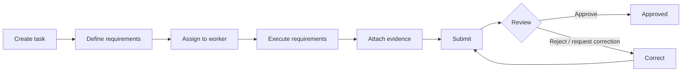

# TaskInspect

**Offline-first task and inspection management platform.**

TaskInspect lets a manager create a task, define the requirements that must be
completed, and assign it to a worker. The worker completes each requirement on
a mobile device — with structured answers and photo evidence — even without a
network connection, then submits it for review. A reviewer approves the task,
rejects it, or requests a correction, and every step is recorded in the task's
history.

> **Status:** in early development — the repository currently contains the
> project structure and documentation; the app and API are being built.

## Project Overview

TaskInspect is built as a small but production-oriented product rather than a
CRUD demo. It consists of:

- **Mobile app** — Flutter, where workers execute tasks and managers review them.
  Works offline and synchronizes in the background when connectivity returns.
- **Backend API** — Java / Spring Boot REST API with PostgreSQL, which owns the
  business rules: who can do what, and which task state changes are allowed.
- **Cloud storage** — photo evidence is stored in object storage (AWS S3), not in
  the database.

The same workflow fits many industries — kitchen safety checks, facility
inspections, maintenance rounds, audits — because requirements are
configurable per task.

## Core Workflow

1. **Create** — a manager creates a task with a title, description, priority
   and deadline.
2. **Define requirements** — each requirement has a type: checkbox, yes/no,
   text, number, dropdown, multiple selection, photo or comment.
3. **Assign** — the task is assigned to a worker.
4. **Execute** — the worker completes each requirement on their phone. This works
   offline: answers are saved locally and synchronized later.
5. **Attach evidence** — photos, values and comments show that the work was
   actually done.
6. **Submit** — the worker submits the task for review.
7. **Review** — the reviewer checks every response and piece of evidence, then
   approves, rejects or requests a correction with a reason.
8. **Correct and resubmit** — a rejected task returns to the worker, who fixes
   it and submits again until it is approved.

The backend enforces every step. For example, a worker cannot approve their own
task, and an approved task cannot be modified — even through a hand-crafted API
request.

### Example: Daily Kitchen Safety Inspection

| Requirement                         | Type    |
|-------------------------------------|---------|
| Is the gas connection safe?         | Yes/No  |
| Record the refrigerator temperature | Number (°C) |
| Is the fire extinguisher available? | Yes/No  |
| Check the electrical equipment      | Checkbox |
| Take a photo of the kitchen         | Photo   |

The worker completes the inspection with no internet connection and submits it.
The app shows *"Submitted locally — waiting for synchronization"* and uploads
everything once the connection returns. The manager reviews the evidence and
asks for the refrigerator photo to be retaken; the worker retakes it and
resubmits, and the manager approves. The task history shows the full lifecycle.
