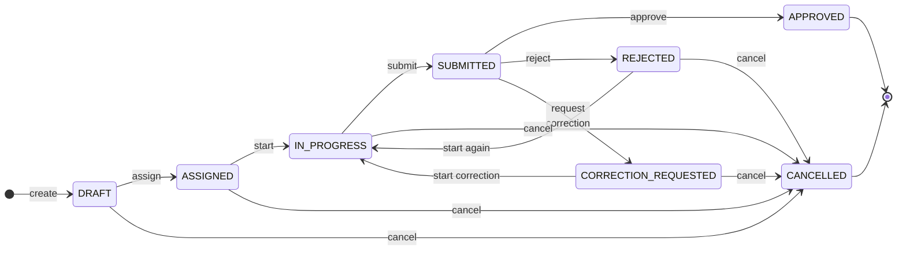
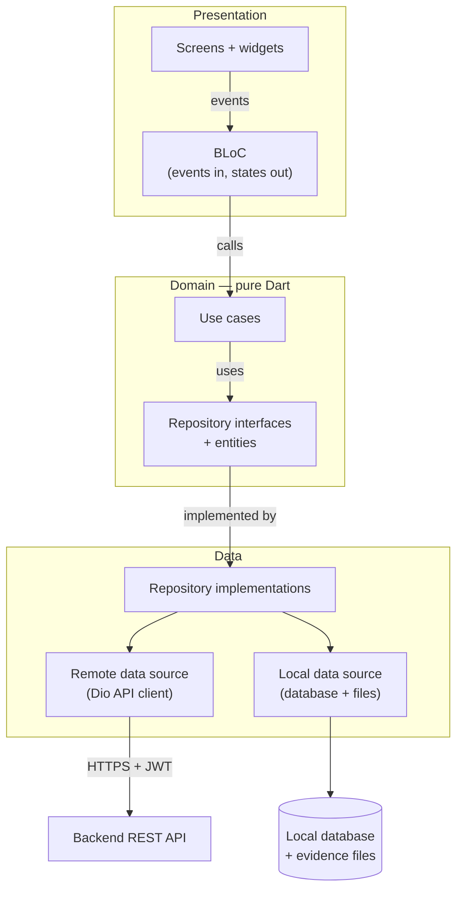
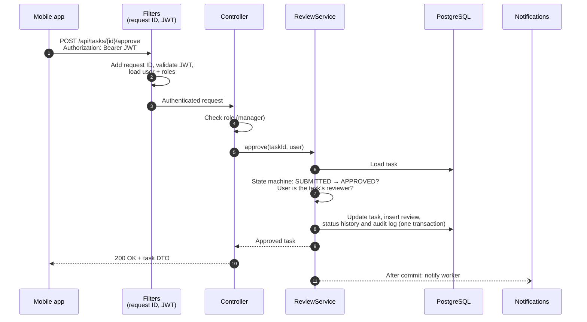
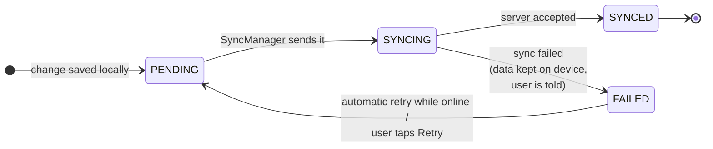
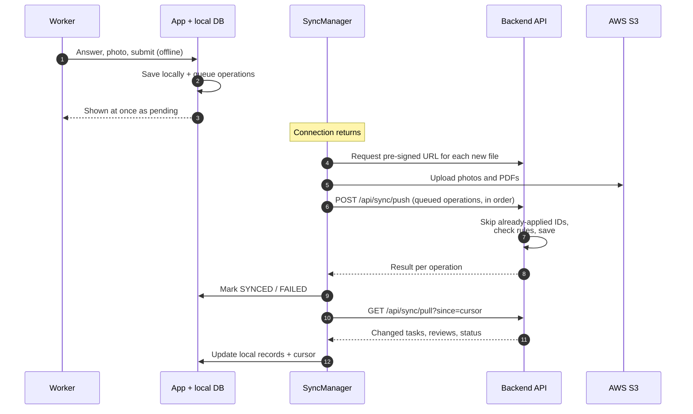

# TaskInspect — Architecture

This document describes how TaskInspect is put together: the main
components, what each one is responsible for, and how they talk to each
other.

## System Overview

TaskInspect has three parts:

- **Mobile app (Flutter)** — used by workers to execute tasks and by
  managers to create, assign and review them. The app is offline-first:
  tasks, answers and evidence files are stored in a local database on the device,
  and a sync manager exchanges changes with the backend whenever a
  connection is available.
- **Backend API (Spring Boot)** — a stateless REST API that owns the
  business rules. It authenticates users with JWT, checks each user's role,
  enforces the task state machine and records every status change and
  important action. The mobile app never writes to the database or
  storage directly — it goes through the API.
- **Data and cloud services** — PostgreSQL is the source of truth for all
  business data. Evidence files (photos and PDFs) go to AWS S3; the
  database keeps only their metadata. Firebase Cloud Messaging delivers
  push notifications, and CloudWatch collects backend logs.

Everything is kept deliberately small: one backend service, one database
and a few managed cloud services, so that the whole system can be
understood and run locally with `docker compose up`.

## Component Diagram


Solid lines are the main request and data paths. Dotted lines are
supporting paths: the optional Redis cache, logging, and push
notifications (the app registers its device with FCM and receives
notifications from it).

## Components

| Component | Responsibility |
|-----------|----------------|
| Flutter UI | Screens for login, dashboard, task list, requirement execution and review. State is managed with BLoC; the UI reads and writes the local database, so it works the same online and offline. |
| Local database | Stores tasks, requirements, answers and the sync queue on the device. It is the source of truth for the UI while offline. |
| Local evidence files | Compressed photos and attached PDF documents waiting to be uploaded, referenced from the local database. |
| Sync manager | Pushes queued local changes to the backend, pulls server changes, uploads evidence files and retries failed operations with backoff. Runs in the background. |
| Spring Boot REST API | Authentication (JWT access + refresh tokens), role-based authorization, task and requirement management, the task state machine, review, audit log and the sync endpoints. Documented with OpenAPI / Swagger. |
| Notification service | Sends notifications for assignment, submission and review results through FCM to the users' registered devices. |
| PostgreSQL | Users, roles, tasks, requirements, responses, reviews, status history, audit log and evidence metadata. Schema managed with Flyway migrations. |
| Redis | Optional cache / short-lived data where it clearly helps; the system works without it. |
| AWS S3 | Stores evidence files (photos and PDF documents). The backend issues a pre-signed upload URL, the app uploads the file directly, and the backend stores the file's metadata (task, requirement, storage key, type, size). |
| Firebase Cloud Messaging | Delivers push notifications to the mobile app (foreground, background and tap to open the task). |
| AWS CloudWatch | Central backend logs, together with Spring Boot Actuator health checks. |

## Key Design Principles

- **The backend enforces the rules.** Roles, allowed state changes and
  ownership are checked on the server, not only in the app.
- **Offline-first mobile.** The app never blocks the user on the network;
  changes are saved locally first and synchronized later.
- **Idempotent synchronization.** Every queued operation has an ID, so
  sending the same request twice never creates duplicate data.
- **Files outside the database.** Photos and PDFs live in object storage; the
  database stores only metadata.
- **Stateless API.** Authentication uses JWT, so the backend can be
  restarted or scaled without losing sessions.

## Task Lifecycle

Every task moves through a fixed set of states. The backend owns this
state machine: each action is a separate API call, and the server checks
that the change is allowed from the current state and by the current user
before applying it. The mobile app only offers the actions that are valid,
but it is never trusted to decide.



### States

| State | Meaning |
|-------|---------|
| `DRAFT` | Created by a manager; title, details and requirements are still being defined. Not visible to workers. |
| `ASSIGNED` | Assigned to a worker, who has not started it yet (shown as *pending* in the app). |
| `IN_PROGRESS` | The worker is completing the requirements and attaching evidence. |
| `SUBMITTED` | The worker has submitted the task; it is waiting for review. |
| `REJECTED` | The reviewer rejected the whole task, with a reason. It is back with the worker, who can change any answer or photo. |
| `CORRECTION_REQUESTED` | The reviewer marked only some requirements as needing a fix, each with a comment. It is back with the worker, who can change only the marked requirements. |
| `APPROVED` | The reviewer accepted the task. Final — it can no longer be changed. |
| `CANCELLED` | A manager cancelled the task. Final. |

### Transitions

| From | To | Action | Who | Conditions |
|------|----|--------|-----|------------|
| — | `DRAFT` | Create (`POST /api/tasks`) | Manager | Title, priority and due date are valid. A reviewer is set (defaults to the creator). |
| `DRAFT` | `ASSIGNED` | Assign (`POST /api/tasks/{id}/assign`) | Manager | The task has at least one requirement; the assignee is an active worker. |
| `ASSIGNED` | `IN_PROGRESS` | Start (`POST /api/tasks/{id}/start`) | Assigned worker | — |
| `IN_PROGRESS` | `SUBMITTED` | Submit (`POST /api/tasks/{id}/submit`) | Assigned worker | Every required requirement has a response. |
| `SUBMITTED` | `APPROVED` | Approve | Task's reviewer | The reviewer is not the assignee (except solo accounts). |
| `SUBMITTED` | `REJECTED` | Reject | Task's reviewer | A reason is given; the reviewer is not the assignee (except solo accounts). |
| `SUBMITTED` | `CORRECTION_REQUESTED` | Request correction | Task's reviewer | At least one requirement is marked, each with a comment; the reviewer is not the assignee (except solo accounts). |
| `REJECTED` | `IN_PROGRESS` | Start again (`POST /api/tasks/{id}/start`) | Assigned worker | — |
| `CORRECTION_REQUESTED` | `IN_PROGRESS` | Start correction (`POST /api/tasks/{id}/start`) | Assigned worker | — |
| `DRAFT`, `ASSIGNED`, `IN_PROGRESS`, `REJECTED`, `CORRECTION_REQUESTED` | `CANCELLED` | Cancel | Manager | — |

*Reject* and *request correction* are two different results:

- **Reject** sends the whole task back. The worker can change every
  answer and photo before submitting again.
- **Request correction** sends back only the requirements the reviewer
  marked (for example *"Please retake the refrigerator photo."*). The
  worker can change only those; all other answers stay as submitted.

Either way the review record stores the result, the reason and the
marked requirements, and the worker is notified.

### Reviewers and Account Types

Every task has its own **reviewer**, chosen when the task is created or
assigned. The reviewer can be a different manager from the one who
created and assigned the task — for example one manager assigns the
work and another reviews and closes it.

TaskInspect is meant for three sizes of account:

| Account | Example | Review rule |
|---------|---------|-------------|
| Solo | One person using tasks as a personal checklist | The same person creates, does and approves the task (self-review is allowed). |
| Small team | One manager with about 10 workers | The reviewer is never the assigned worker. |
| Organization | Many managers, each with their own workers | The reviewer is never the assigned worker; any manager can be a task's reviewer. |

The first release has one default organization; users and tasks already
carry an `organization_id` so that full organizations (sign-up, several
organizations, managers with their own workers) can be added later
without reshaping the data.

### Rules

- **Invalid changes are rejected.** Any action that is not in the table —
  for example approving a task that is still `IN_PROGRESS` — returns
  `409 Conflict` with the error code `TASK_INVALID_TRANSITION`. Acting on a
  final task returns a specific code such as `TASK_ALREADY_APPROVED`.
- **Roles are checked on every call.** A worker can never approve or
  reject a task — including their own — even with a hand-crafted request.
  Only the task's reviewer can review it; in a solo account that is the
  same person, who holds both the manager and worker roles.
- **Responses are editable only while the task is `IN_PROGRESS`.** Once a
  task is submitted, the worker's answers and evidence are locked. After a
  *reject* they are all editable again; after a *request correction* only
  the marked requirements are.
- **Final states are final.** `APPROVED` and `CANCELLED` tasks cannot be
  modified.
- **Every change is recorded.** Each transition writes a row to the task's
  status history (old state, new state, user, time, reason) and an entry
  in the audit log. These rows build the task history timeline (created,
  assigned, started, submitted, rejected, correction requested,
  resubmitted, approved).
- **Changes trigger notifications.** Assigning, submitting, approving,
  rejecting and requesting a correction notify the other party through
  push notifications.
- **Offline actions are applied when they reach the server.** A worker can
  start and submit a task offline; the app shows it as *submitted locally*
  and the state machine checks the action when it is synchronized (see
  the offline sync section).

## Mobile Architecture

The Flutter app follows **feature-based Clean Architecture** with
**BLoC** for state management. Each feature (authentication, tasks,
requirements, evidence, review, ...) is split into the same three layers,
and dependencies always point inwards: the UI knows about the domain, the
data layer implements the domain, and the domain knows about neither.



Arrows show how a call travels. The code dependencies point the other
way where it matters: repository implementations in the data layer
depend on the interfaces defined in the domain, so the domain never
imports anything from the data layer.

### Layers

| Layer | Folder | Contains | Depends on |
|-------|--------|----------|------------|
| Presentation | `features/<feature>/presentation/` | Screens, widgets and BLoCs. Widgets send events to a BLoC and rebuild from the states it emits. | Domain |
| Domain | `features/<feature>/domain/` | Entities (e.g. `Task`, `Requirement`, `Response`), repository interfaces and use cases (e.g. `StartTask`, `SaveResponse`, `SubmitTask`). Plain Dart — no Flutter, HTTP or database code. | Nothing |
| Data | `features/<feature>/data/` | Models (JSON and database mapping), remote data sources (API calls), local data sources (database queries) and the repository implementations that combine them. | Domain |

Shared building blocks live outside the features: `core/` holds
infrastructure used by every feature (API client, local database, secure
storage, synchronization, error types, theme, router, dependency
injection), and `shared/` holds reusable widgets, models and extensions.

### Folder Structure

```text
mobile/lib/
├── core/
│   ├── constants/
│   ├── error/            # exceptions, failures, error-to-message mapping
│   ├── network/          # Dio client, auth + token refresh interceptor
│   ├── storage/          # local database, file storage
│   ├── security/         # secure token storage
│   ├── synchronization/  # sync queue + SyncManager
│   ├── utils/
│   ├── theme/            # Material 3, light + dark
│   └── router/
├── features/
│   ├── authentication/   # each feature: data/ domain/ presentation/
│   ├── dashboard/
│   ├── tasks/
│   ├── requirements/
│   ├── evidence/
│   ├── review/
│   └── profile/
├── shared/
│   ├── widgets/
│   ├── models/
│   └── extensions/
└── main.dart
```

### Data Flow: Answering a Requirement

The local database is the app's source of truth. Screens read from it
and every change is written there first, so the app behaves the same
online and offline:

1. The worker answers "Is the gas connection safe?" with *Yes*. The
   widget sends a `ResponseChanged` event to the execution BLoC.
2. The BLoC calls the `SaveResponse` use case.
3. The repository writes the response to the local database with
   `syncStatus = PENDING` and adds an operation to the sync queue — in
   one transaction.
4. The local database notifies its watchers; the BLoC emits a new state
   and the screen shows the answer immediately, without waiting for the
   network.
5. Later, the SyncManager sends the queued operation to the backend and
   marks the record `SYNCED` (see the offline sync section).

Actions that only make sense online — logging in, or a manager
assigning or reviewing tasks — go straight to the API through the remote
data source, and the result is then stored locally.

### State Management (BLoC)

- One BLoC (or Cubit for simple screens) per screen or flow, e.g.
  `AuthBloc`, `TaskListBloc`, `TaskExecutionBloc`, `ReviewBloc`.
- BLoCs only talk to use cases, never to Dio or the database directly.
- States cover every case the UI must show: loading, success, empty,
  offline, syncing, sync failed, unauthorized, server error and no
  internet.
- An app-wide `AuthBloc` tracks the session; when the token can no longer
  be refreshed it logs the user out and the router returns to login.

### Error Handling

The data layer catches exceptions (network, server, database) and turns
them into typed failures — for example `NetworkFailure`,
`UnauthorizedFailure` or `ServerFailure(code)` using the backend's error
code. Use cases return either a result or a failure, and the presentation
layer maps each failure to a user-friendly message, such as *"Changes
saved locally. They will sync when you're online."*

### Testability

Because each layer depends only on interfaces, it can be tested on its
own: use cases and BLoCs with mocked repositories, repositories with
mocked data sources, and screens with widget tests. Dependencies are
wired in one place with dependency injection, so tests can swap in fakes.

## Backend Architecture

The backend is a single Spring Boot application (a modular monolith). It
is organised **by feature**: each module owns its controllers, services,
repositories, entities and DTOs, and inside every module the code follows
the same layers.

### Layers

| Layer | Contains | Responsibility |
|-------|----------|----------------|
| Controller | `@RestController` classes, request / response DTOs | HTTP only: validate the request body, check the caller's role, call a service, return a DTO. No business logic. |
| Service | `@Service` classes | Business rules and transactions: the task state machine, ownership checks ("is this the assigned worker?"), writing status history and audit entries. |
| Repository | Spring Data JPA interfaces | Database access for the module's entities. |
| Domain | JPA entities, enums (`TaskStatus`, `RequirementType`) | The data model. Entities are never returned from the API; controllers map them to DTOs. |

Larger modules such as tasks can later grow into a richer structure
(application service → domain → repository interface → infrastructure);
the module boundary stays the same.

### Modules

| Module | Responsibility | Built in |
|--------|----------------|----------|
| `auth` | Login, JWT access tokens, refresh tokens, logout | 2.12-2.19 |
| `users` | Users and roles (administrator, manager, worker) | 2.9-2.11, 2.20 |
| `tasks` | Tasks, assignment, state machine, status history | 3.1-3.6, 3.9-3.10, 3.12 |
| `requirements` | Requirements and their options | 3.7-3.8 |
| `responses` | Workers' answers to requirements | 3.11 |
| `reviews` | Submit, approve, reject, request correction, resubmit | 7.1-7.4 |
| `evidence` | Evidence metadata and upload flow | 5.17, 8.2 |
| `filestorage` | Wrapper around S3 (pre-signed URLs), replaceable in tests | 8.1-8.2 |
| `sync` | Idempotent push / pull endpoints for the mobile app | 6.4, 6.6 |
| `notifications` | Device tokens and push notifications through FCM | 8.5-8.6 |
| `audit` | Audit log of important actions | 3.13 |
| `common` | Security config, error handling, request ID logging, OpenAPI | 2.7-2.8, 2.13, 2.21 |

Full organizations (multi-tenant support, spec section 14) come after
the first release. Users and tasks carry an `organization_id` from the
start, with one default organization (see *Reviewers and Account Types*).

Modules use each other only through services — for example the reviews
module calls `TaskService` to change a task's state, never
`TaskRepository` directly — so each rule lives in exactly one place.

### Package Structure

```text
backend/src/main/java/<base package>/
├── auth/
├── users/
├── tasks/
│   ├── TaskController.java
│   ├── TaskService.java
│   ├── TaskStateMachine.java
│   ├── TaskRepository.java
│   ├── Task.java
│   ├── TaskStatus.java
│   └── dto/
├── requirements/
├── responses/
├── reviews/
├── evidence/
├── filestorage/
├── sync/
├── notifications/
├── audit/
└── common/
    ├── config/
    ├── error/      # error response format + global exception handler
    ├── security/   # security config, JWT filter
    └── logging/    # request ID / correlation ID
backend/src/main/resources/
├── application.yml
└── db/migration/   # Flyway migrations (V1__..., V2__...)
```

The base package is chosen when the project is generated (task 2.1).

### Request Flow: Approving a Task



If any check fails, the service throws a business exception (for example
`TASK_INVALID_TRANSITION`) and nothing is written. A global exception
handler turns every error into the same JSON shape:

```json
{
  "timestamp": "2026-10-01T09:30:00Z",
  "status": 409,
  "code": "TASK_INVALID_TRANSITION",
  "message": "Task cannot be approved in status IN_PROGRESS",
  "requestId": "3f2a9c1e"
}
```

### API Permissions

Every endpoint checks the caller's role (`@PreAuthorize`) and, where it
matters, ownership in the service. Tasks a user may not see answer
`404`, so their existence is not revealed.

| Endpoint | Allowed | Everyone else |
|----------|---------|---------------|
| `POST /api/auth/login`, `/refresh`, `/logout` | Anyone | — |
| `GET /api/auth/me` | Any logged-in user | `401` |
| `GET /api/users` | Administrators, managers | `403` |
| `GET /api/users/{id}` | Administrators, managers; others only themselves | `403` |
| `POST /api/users` | Administrators | `403` |
| `POST /api/tasks` | Managers | `403` |
| `GET /api/tasks`, `GET /api/tasks/{id}` | Administrators and managers: all tasks of their organization; workers: tasks assigned to them | `404` (hidden) |
| `PUT /api/tasks/{id}` | The manager who created the task, while DRAFT / ASSIGNED | `403` |
| `POST/PUT/DELETE /api/tasks/{id}/requirements…` | The manager who created the task, while DRAFT / ASSIGNED | `403` |
| `GET /api/tasks/{id}/requirements`, `…/responses`, `…/evidence` | Anyone who can see the task | `404` |
| `POST /api/tasks/{id}/assign` | The manager who created the task | `403` |
| `POST /api/tasks/{id}/start` | The assigned worker | `403` / `404` |
| `PUT /api/tasks/{id}/requirements/{rid}/response` | The assigned worker, while IN_PROGRESS | `403` / `404` |
| `POST /api/tasks/{id}/requirements/{rid}/evidence`, `DELETE /api/tasks/{id}/evidence/{eid}` | The assigned worker, while IN_PROGRESS (PHOTO: JPEG/PNG up to 10 MB; DOCUMENT: PDF up to 20 MB) | `403` / `404` |

Without a valid access token every endpoint except login, refresh,
logout, health checks and API docs answers `401`.

### Cross-cutting Concerns

- **Security** — stateless Spring Security: a JWT filter authenticates
  every request except login and refresh; roles are checked on each
  endpoint; passwords are hashed with BCrypt; secure headers are on.
- **Validation** — request DTOs use Bean Validation (`@NotBlank`,
  `@Size`, ...); invalid input returns `400` with a `VALIDATION_ERROR`
  code and the failing fields.
- **Transactions** — each service method that changes data runs in one
  transaction, so a state change, its history row and its audit entry are
  saved together or not at all. Notifications are sent only after the
  transaction commits.
- **Database** — PostgreSQL with Flyway migrations; the schema is never
  changed by Hibernate (`ddl-auto=validate`). Tables use UUID primary
  keys, created / updated timestamps and indexes on frequently filtered
  columns (status, assignee, due date).
- **Configuration** — settings and secrets come from environment
  variables (`.env` locally, never committed).
- **Observability** — structured logs with a request ID on every line,
  Spring Boot Actuator health checks, and CloudWatch in production.
- **API documentation** — OpenAPI / Swagger UI generated from the
  controllers.

## Offline Sync

Workers often inspect sites with a weak or no connection, so the app is
built to work fully offline and to catch up with the server later. The
local database is the app's source of truth; a **SyncManager** in
`core/synchronization/` moves changes between the device and the backend
in the background.

### What Works Offline

| Offline | Online only |
|---------|-------------|
| Open tasks already downloaded to the device | Log in |
| Create and edit draft tasks and their requirements (manager) | Assign tasks (manager) |
| Start a task | Review: approve, reject, request correction |
| Answer requirements, add comments | Download tasks not yet on the device |
| Take photos, attach PDF documents | |
| Submit a task (shown as *submitted locally*) | |

A task created offline gets its ID on the device and is sent to the
server as a `DRAFT` at the next sync; the manager assigns it once
online.

Online-only actions go straight to the API and show a clear message when
there is no connection.

### Sync Queue

Every offline change is written to the local database **and** added to
the sync queue in the same local transaction (see *Data Flow* above).
Each queued operation has:

| Field | Example | Purpose |
|-------|---------|---------|
| `id` | UUID created on the device | Idempotency key — the server never applies the same operation twice. |
| `entityType` | `TaskResponse` | What changed. |
| `entityId` | `8c1f…` | Which record changed. |
| `operation` | `UPDATE` | `CREATE`, `UPDATE`, `DELETE` or a task action (`START`, `SUBMIT`). |
| `payload` | `{ "value": "YES" }` | The data to send. |
| `createdAt` | `2026-10-01T09:30:00Z` | Keeps operations in order. |
| `retryCount` | `2` | How many times sending has failed. |
| `lastError` | `NETWORK_TIMEOUT` | Why the last attempt failed. |
| `status` | `PENDING` | See the states below. |



The queue is stored in the database, not in memory, so nothing is lost
when the app is closed or the phone restarts. Its contents can be shown
in the app and inspected in tests.

### Sync Cycle



1. **Files first.** Photos and PDFs are uploaded before the operations that
   depend on them, so a task is never submitted to the server with
   evidence the server cannot find. Files have their own upload queue
   with the same statuses and retries (task 6.12).
2. **Push.** `POST /api/sync/push` sends pending operations in the order
   they were created. The server records every applied operation ID in
   `sync_records`; if an ID arrives again (for example after a timeout),
   it returns the earlier result instead of applying it twice. Each
   operation goes through the same services and rules as a normal API
   call — the task state machine, role and ownership checks.
3. **Pull.** `GET /api/sync/pull?since=<cursor>` returns everything that
   changed on the server since the last pull: new assignments, status
   changes, review results and reasons. The app stores the new cursor
   only after the changes are saved locally.
4. **Order per task.** If an operation for a task fails, later
   operations for the same task wait, so for example a submit is never
   sent before the answers it depends on. Other tasks keep syncing.

### When Sync Runs

The rule is simple: **whenever the device is online, the app tries to
sync.**

- As soon as the connection comes back (connectivity detection, task
  6.3).
- When the app starts or returns to the foreground.
- Shortly after a local change, grouped so that quick edits are sent
  together.
- Periodically in the background (task 6.11). Android schedules this
  with WorkManager; on iOS, background time is limited and decided by the
  system, so the app also syncs every time it is opened. Both platforms
  use the same SyncManager.

### Retries and Errors

| Error | What happens |
|-------|--------------|
| No connection, timeout, `5xx` | Temporary: the operation becomes `FAILED`, the user is told and gets a **Retry** button. While the device is online the app keeps retrying automatically with a growing delay (30 s, 1 min, 2 min, … up to 5 min), and it retries at once when the connection comes back. It never gives up on unsent data. |
| `401` — access token expired | The app refreshes the token once and retries. If the refresh token has also expired, sync pauses, the queue is kept and the user is asked to sign in again; sync continues after login. |
| `4xx` business error (e.g. `TASK_INVALID_TRANSITION`) | The server refused the change: the operation becomes `FAILED` with the server's reason shown to the user (for example *"This task was cancelled by the manager"*). It is not retried automatically, because the same request would fail again; the Retry button is still there. |

Whatever happens, **data is never lost**: a failed change stays in the
local database and the sync queue until it is synced, and is never
deleted silently.

### Conflicts

The server is the source of truth for a task's status; the device is the
source of truth for the worker's own unsent answers.

- **The task changed on the server while the worker was offline** — for
  example the manager cancelled it. The worker's `SUBMIT` is rejected with
  a clear error code, the operation becomes `FAILED`, the next pull
  brings the new status, and the app shows why (*"This task was cancelled
  by the manager"*). The worker's answers stay on the device for
  reference.
- **Stale updates** — tasks carry a version number (optimistic locking).
  An operation based on an old version of a task is rejected instead of
  overwriting newer data.
- **Answers** — only the assigned worker can change a task's answers, so
  two people never edit the same response. When the same answer is
  changed several times offline, the operations are applied in order and
  the last one wins.

### Sync Status in the App

| Situation | What the user sees |
|-----------|--------------------|
| No connection | Offline banner: *"Changes saved locally. They will sync when you're online."* |
| Changes waiting | Pending badge on the task and a count of unsent changes |
| Syncing | Progress indicator |
| Submitted offline | *"Submitted locally — waiting for synchronization."* |
| Failed | *"Unable to synchronize. Your changes are saved on this device."* with a **Retry** button |
| Session expired | *"Your session has expired. Please sign in again."* |

### Built In

| Part | Tasks |
|------|-------|
| Sync queue table and recording changes | 6.1-6.2 |
| Connectivity detection | 6.3 |
| Push endpoint + SyncManager push | 6.4-6.5 |
| Pull endpoint + SyncManager pull | 6.6-6.7 |
| Retries, expired login, conflicts | 6.8-6.10 |
| Background sync, evidence upload queue | 6.11-6.12 |
| Sync status UI and tests | 6.13-6.14 |

The full sync API and edge cases are documented in `docs/offline-sync.md`
(task 11.9).
