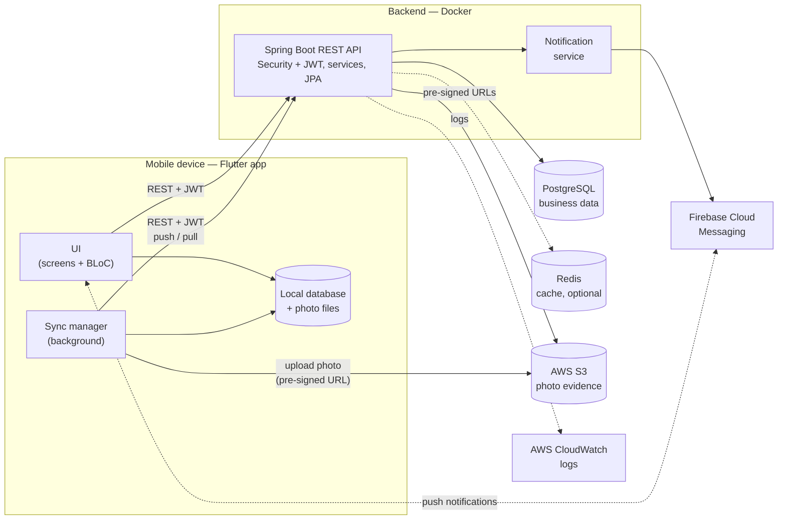
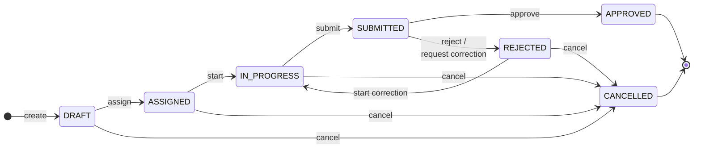

# TaskInspect — Architecture

This document describes how TaskInspect is put together: the main
components, what each one is responsible for, and how they talk to each
other. More sections (mobile architecture, backend architecture and
offline sync) are added as the project grows.

## System Overview

TaskInspect has three parts:

- **Mobile app (Flutter)** — used by workers to execute tasks and by
  managers to create, assign and review them. The app is offline-first:
  tasks, answers and photos are stored in a local database on the device,
  and a sync manager exchanges changes with the backend whenever a
  connection is available.
- **Backend API (Spring Boot)** — a stateless REST API that owns the
  business rules. It authenticates users with JWT, checks each user's role,
  enforces the task state machine and records every status change and
  important action. The mobile app never writes to the database or
  storage directly — it goes through the API.
- **Data and cloud services** — PostgreSQL is the source of truth for all
  business data. Photo evidence goes to AWS S3; the database keeps only its
  metadata. Firebase Cloud Messaging delivers push notifications, and
  CloudWatch collects backend logs.

Everything is kept deliberately small: one backend service, one database
and a few managed cloud services, so that the whole system can be
understood and run locally with `docker compose up`.

## Component Diagram

Solid lines are the main request and data paths. Dotted lines are
supporting paths: the optional Redis cache, logging, and push
notifications (the app registers its device with FCM and receives
notifications from it).

## Components

| Component | Responsibility |
|-----------|----------------|
| Flutter UI | Screens for login, dashboard, task list, requirement execution and review. State is managed with BLoC; the UI reads and writes the local database, so it works the same online and offline. |
| Local database | Stores tasks, requirements, answers and the sync queue on the device. It is the source of truth for the UI while offline. |
| Local photo files | Compressed photos waiting to be uploaded, referenced from the local database. |
| Sync manager | Pushes queued local changes to the backend, pulls server changes, uploads photos and retries failed operations with backoff. Runs in the background. |
| Spring Boot REST API | Authentication (JWT access + refresh tokens), role-based authorization, task and requirement management, the task state machine, review, audit log and the sync endpoints. Documented with OpenAPI / Swagger. |
| Notification service | Sends notifications for assignment, submission and review results through FCM to the users' registered devices. |
| PostgreSQL | Users, roles, tasks, requirements, responses, reviews, status history, audit log and evidence metadata. Schema managed with Flyway migrations. |
| Redis | Optional cache / short-lived data where it clearly helps; the system works without it. |
| AWS S3 | Stores photo evidence. The backend issues a pre-signed upload URL, the app uploads the photo directly, and the backend stores the file's metadata (task, requirement, storage key, type, size). |
| Firebase Cloud Messaging | Delivers push notifications to the mobile app (foreground, background and tap to open the task). |
| AWS CloudWatch | Central backend logs, together with Spring Boot Actuator health checks. |

## Key Design Principles

- **The backend enforces the rules.** Roles, allowed state changes and
  ownership are checked on the server, not only in the app.
- **Offline-first mobile.** The app never blocks the user on the network;
  changes are saved locally first and synchronized later.
- **Idempotent synchronization.** Every queued operation has an ID, so
  sending the same request twice never creates duplicate data.
- **Files outside the database.** Photos live in object storage; the
  database stores only metadata.
- **Stateless API.** Authentication uses JWT, so the backend can be
  restarted or scaled without losing sessions.

## Task Lifecycle

Every task moves through a fixed set of states. The backend owns this
state machine: each action is a separate API call, and the server checks
that the change is allowed from the current state and by the current user
before applying it. The mobile app only offers the actions that are valid,
but it is never trusted to decide.

### States

| State | Meaning |
|-------|---------|
| `DRAFT` | Created by a manager; title, details and requirements are still being defined. Not visible to workers. |
| `ASSIGNED` | Assigned to a worker, who has not started it yet (shown as *pending* in the app). |
| `IN_PROGRESS` | The worker is completing the requirements and attaching evidence. |
| `SUBMITTED` | The worker has submitted the task; it is waiting for review. |
| `REJECTED` | The reviewer rejected the task or requested a correction, with a reason. It is back with the worker. |
| `APPROVED` | The reviewer accepted the task. Final — it can no longer be changed. |
| `CANCELLED` | A manager cancelled the task. Final. |

### Transitions

| From | To | Action | Who | Conditions |
|------|----|--------|-----|------------|
| — | `DRAFT` | Create (`POST /api/tasks`) | Manager | Title, priority and due date are valid. |
| `DRAFT` | `ASSIGNED` | Assign (`POST /api/tasks/{id}/assign`) | Manager | The task has at least one requirement; the assignee is an active worker. |
| `ASSIGNED` | `IN_PROGRESS` | Start (`POST /api/tasks/{id}/start`) | Assigned worker | — |
| `IN_PROGRESS` | `SUBMITTED` | Submit (`POST /api/tasks/{id}/submit`) | Assigned worker | Every required requirement has a response. |
| `SUBMITTED` | `APPROVED` | Approve | Manager / reviewer | The reviewer is not the assignee. |
| `SUBMITTED` | `REJECTED` | Reject or request correction | Manager / reviewer | A reason is given; the reviewer is not the assignee. |
| `REJECTED` | `IN_PROGRESS` | Start correction (`POST /api/tasks/{id}/start`) | Assigned worker | — |
| `DRAFT`, `ASSIGNED`, `IN_PROGRESS`, `REJECTED` | `CANCELLED` | Cancel | Manager | — |

*Reject* and *request correction* lead to the same state. The review
record stores which one the reviewer chose, the reason, and (optionally)
the requirements that need to be redone, so the worker knows exactly what
to fix.

### Rules

- **Invalid changes are rejected.** Any action that is not in the table —
  for example approving a task that is still `IN_PROGRESS` — returns
  `409 Conflict` with the error code `TASK_INVALID_TRANSITION`. Acting on a
  final task returns a specific code such as `TASK_ALREADY_APPROVED`.
- **Roles are checked on every call.** A worker can never approve or
  reject a task — including their own — even with a hand-crafted request.
- **Responses are editable only while the task is `IN_PROGRESS`.** Once a
  task is submitted, the worker's answers and evidence are locked until the
  task is rejected back to them.
- **Final states are final.** `APPROVED` and `CANCELLED` tasks cannot be
  modified.
- **Every change is recorded.** Each transition writes a row to the task's
  status history (old state, new state, user, time, reason) and an entry
  in the audit log. These rows build the task history timeline (created,
  assigned, started, submitted, rejected, resubmitted, approved).
- **Changes trigger notifications.** Assigning, submitting, approving and
  rejecting notify the other party through push notifications.
- **Offline actions are applied when they reach the server.** A worker can
  start and submit a task offline; the app shows it as *submitted locally*
  and the state machine checks the action when it is synchronized (see
  the offline sync section).
