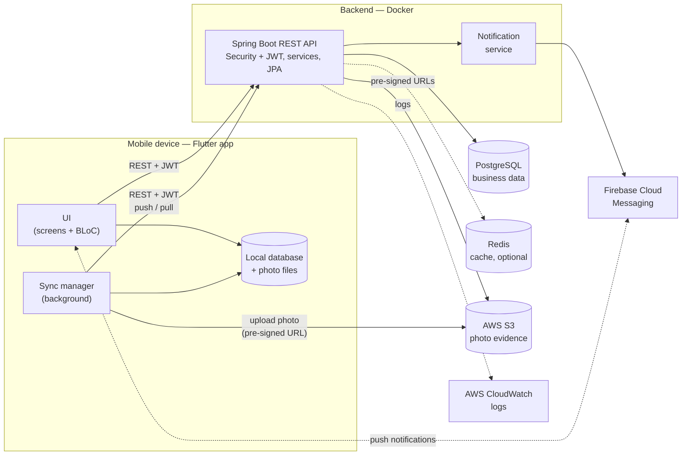

# TaskInspect — Architecture

This document describes how TaskInspect is put together: the main
components, what each one is responsible for, and how they talk to each
other. More sections (task lifecycle, mobile architecture, backend
architecture and offline sync) are added as the project grows.

## System Overview

TaskInspect has three parts:

- **Mobile app (Flutter)** — used by workers to execute tasks and by
  managers to create, assign and review them. The app is offline-first:
  tasks, answers and photos are stored in a local database on the device,
  and a sync manager exchanges changes with the backend whenever a
  connection is available.
- **Backend API (Spring Boot)** — a stateless REST API that owns the
  business rules. It authenticates users with JWT, checks each user's role,
  enforces the task state machine and records every status change and
  important action. The mobile app never writes to the database or
  storage directly — it goes through the API.
- **Data and cloud services** — PostgreSQL is the source of truth for all
  business data. Photo evidence goes to AWS S3; the database keeps only its
  metadata. Firebase Cloud Messaging delivers push notifications, and
  CloudWatch collects backend logs.

Everything is kept deliberately small: one backend service, one database
and a few managed cloud services, so that the whole system can be
understood and run locally with `docker compose up`.

## Component Diagram

Solid lines are the main request and data paths. Dotted lines are
supporting paths: the optional Redis cache, logging, and push
notifications (the app registers its device with FCM and receives
notifications from it).

## Components

| Component | Responsibility |
|-----------|----------------|
| Flutter UI | Screens for login, dashboard, task list, requirement execution and review. State is managed with BLoC; the UI reads and writes the local database, so it works the same online and offline. |
| Local database | Stores tasks, requirements, answers and the sync queue on the device. It is the source of truth for the UI while offline. |
| Local photo files | Compressed photos waiting to be uploaded, referenced from the local database. |
| Sync manager | Pushes queued local changes to the backend, pulls server changes, uploads photos and retries failed operations with backoff. Runs in the background. |
| Spring Boot REST API | Authentication (JWT access + refresh tokens), role-based authorization, task and requirement management, the task state machine, review, audit log and the sync endpoints. Documented with OpenAPI / Swagger. |
| Notification service | Sends notifications for assignment, submission and review results through FCM to the users' registered devices. |
| PostgreSQL | Users, roles, tasks, requirements, responses, reviews, status history, audit log and evidence metadata. Schema managed with Flyway migrations. |
| Redis | Optional cache / short-lived data where it clearly helps; the system works without it. |
| AWS S3 | Stores photo evidence. The backend issues a pre-signed upload URL, the app uploads the photo directly, and the backend stores the file's metadata (task, requirement, storage key, type, size). |
| Firebase Cloud Messaging | Delivers push notifications to the mobile app (foreground, background and tap to open the task). |
| AWS CloudWatch | Central backend logs, together with Spring Boot Actuator health checks. |

## Key Design Principles

- **The backend enforces the rules.** Roles, allowed state changes and
  ownership are checked on the server, not only in the app.
- **Offline-first mobile.** The app never blocks the user on the network;
  changes are saved locally first and synchronized later.
- **Idempotent synchronization.** Every queued operation has an ID, so
  sending the same request twice never creates duplicate data.
- **Files outside the database.** Photos live in object storage; the
  database stores only metadata.
- **Stateless API.** Authentication uses JWT, so the backend can be
  restarted or scaled without losing sessions.
